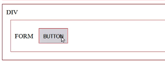
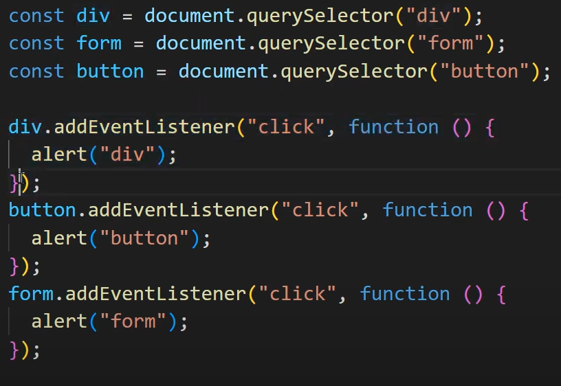
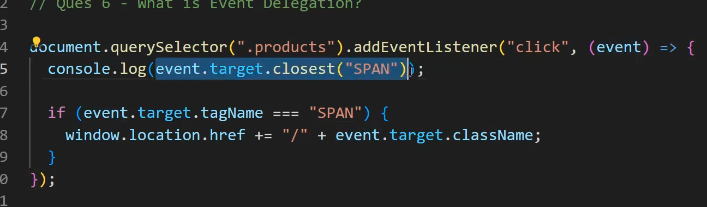

# react-coding

# JS Concepts

# var, let and const

# Scope
- var is a global scope
- let and const are block scope

# Variable Shadowing
- Can shadow let with let
- Can shadow var using let
- But cant shadow let using var (Illegal Shadowing)

# Declaration
- Can redeclare var in same scope
- Cant redeclare let and const in same scope
- We should always initialize const variables

Eg:
```js
var a = 10;
var a = 5; //accepted

let a = 10;
let a = 5; //not accepted

const a = 10;
const a = 5; //not accepted
```

# Re-Initialisation
- var and let can be reinitialized
- const cant be reinitialized

```js
var a = 10;
a = 5;      //accepted

let a = 10;
 a = 5;    //accepted

const a = 10;
a = 5;       //not accepted
```

# Hoisting
- Temporal Dead Zone - Time btw initialization and declaration of let and const

```js
console.log(a);
let a = 10;
```

# Synchronous vs Asynchornous
- JS executes synchronous code first then Async code

# Callbacks

```js
console.log("start");

function importantAction(message, cb){
    setTimeout( ()=>{
        cb(`Helloo I am ${message}`);
    }, 1000);
}
function another(message,cb){
    setTimeout(() => {
        cb(`Heyyyy I am ${message} `);
    },500)
}

const action = importantAction("Renuu", function (message){
    console.log(message);
    another("Renuuuu",function (message){
        console.log(message);
    })
});
console.log("stop");
```
Output:
start
stop
Hellooo I am Renuuu
Heyyy I am Renuuu

- Nesting of Callback functions makes our code messy -> Pyramid of doom -> Concept is called Callback Hell
- Solution is Promises

# Promise
- Relationship btw Mother and a Child
- If a Child promises he does the work (fulfills a promise) then he will get a reward
- If not then he dont (rejects a promise)

```js
console.log("start");
const PromiseFunc = new Promise((resolve, reject) => {
    setTimeout(()=>{
        const result = true;
        result ? resolve("Finished the work given by Mom") : reject("Not done the work given my Mom")
    },2000);
}) 
PromiseFunc.then((res)=> {
    console.log(res);
})
.catch((err)=> {
    console.log(err);
})
console.log("stop");
```
Output:
start
stop
Finished work given ny Mom

- If console.log(PromiseFunc) in above you get promise<pending>
- After 2 secs it will be fullfilled inside and "Finished the work"
- If by default you want to get promise<fullfilled> then
- Similar for reject as well

```js
const promisefun = Promise.resolve("Finished the work");
promisefun.then((res)=>{
    console.log(res);
})
```
Output:
Finished the work
If just console promisefun alone => promise<fullfilled>

# Rewriting Callback with Promises

```js
    console.log("start");
    function importantAction(message){
        return new Promise((resolve, reject) => {
            setTimeout( ()=>{
                resolve(`Helloo I am ${message}`);
            }, 1000);
        })
        
    }
    function another(message){
        return new Promise((resolve, reject) => {
            setTimeout(() => {
                resolve(`Heyyyy I am ${message} `);
            },500)
        })
        
    }
    importantAction("Renuuu").then ((res) => {
        console.log(res);
        another("Another").then((res) => {
            console.log(res);
        })
    }).catch((err) => {
        console.log(err);
    });
    console.log("stop");
```
Output:
start
stop
Hellooo I am Renu
Heyyy I am Another

- The above code is again messy creating Pyramid of doom. we will execute promise chaining

# Promise Chaining

```js
importantAction("Renuuu").then ((res) => {
        console.log(res);
        return another("Anotherrr");
    }).then((res)=>{
        console.log(res);
    }).catch((err) => {
        console.log(err);
    });
```
- The above is cleaner approach
- every call to a .then returns a new promise
- When a handler returns a value, it becomes the result of that promise, so the next .then is called with it.

# Promise Combinators

# Promise.all()
- If we want to execute many promises in parallel
- Takes an array with all of promises 
- If any one of the Promise fails, this will all fail, it will not go to .then() block

```js
Promise.all([
        importantAction("Renuuu"),
        another("Anotherrr")
    ]).then((res) => {
        console.log(res);
    }).catch((err)=>{
        console.log(err);
    });
```
Output:
start
stop
Hello I am Renuu
Heyy I am Another


```js
Promise.all([
        importantAction("Renuuu"),
        another("Anotherrr")
    ]).then((res) => {
        console.log(res);
    }).catch((err)=>{
        console.log("Error in promise - ", err);
    });
```
Output:
Error in promise - Heyy I am from Another (we rejected the second)

# Promise.race()
- It will return the first promise whether it is fulfilled or rejected (with shorter time)
- If another has short wait time of 500ms, then it will return as rejected

# Promise.allSettled()
- Even if any one fails, it will return all the promises

# Promise.any()
- It will only return the first fulfilled promise and ignores the rejected
- If all promises are rejected, it will go to catch block and gives Error

# Async/Await
- if we want promises to be executed one after the other
- Await will wait until the promise is fulfilled/rejected state
- since we are using async operations using await we use async in the function

```js
 const result = async () =>{
        try{
            const message1 = await importantAction("Renuuu");
            const message2 = await another("Anotherrr");
            console.log(message1, message2);
        }
        catch(err){
            console.log("Promise error in",err)
        }
        finally{
            console.log("This will run if error is there or not")
        }
    }
    result();
```

# Event Propagation
- The sequence of the events occurring btw these

Eg:



# Event Bubbling
- Bubble goes from bottom to top
- According to example, the events will fire like => button => form => div
- Normal behaviour of events
- event.target - will give what our target is (bubble bottom) (button)
- this.target == event.currentTarget (div, form) (as it is)

# Events that do not bubble
- Focus, Blur
- Any events specific to one element do not bubble: focus, blur, load, unload, change, reset, scroll, most of the DOM events (DOMFocusIn, DOMFocusOut, DOMNodeRemoved, etc), mouseenter, mouseleave, etc

# Event Capturing/Trickling
- Make the events fire from top to bottom?
- {capture: true}

# How to stop Bubbling or Capturing
- Add e.stopPropagation() whereever you dont want to log

# Event Delegation
- Suppose we have 6 cards and a parent div
- Instead of adding events to each card, we add the event to the parent



